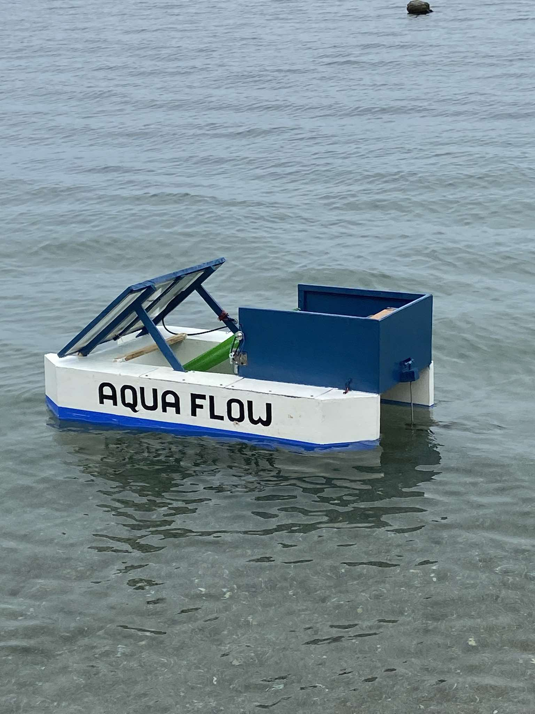
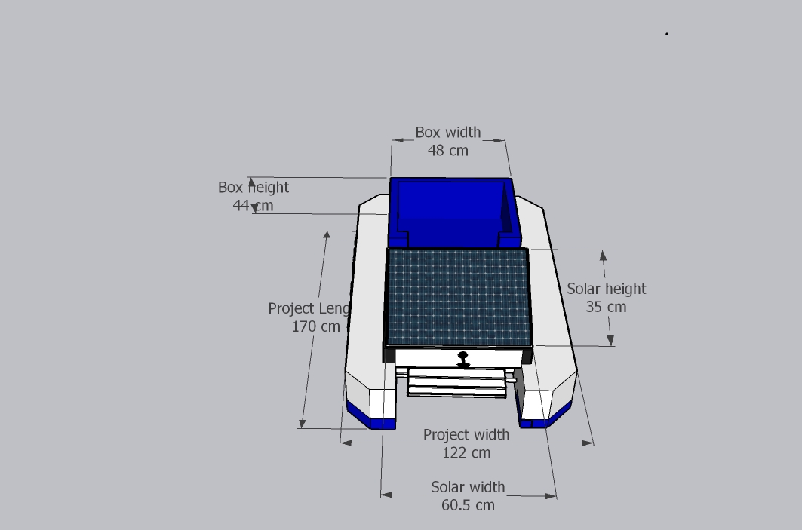

AQUAFLOW
IoT-Based Solar-Powered River Trash Collector

AQUAFLOW is an IoT-enabled, solar-powered river trash collection system designed to help reduce water pollution by automatically collecting floating waste while providing real-time monitoring through a mobile application.

🚀 Features
- Solar-powered floating trash collection system
- Object Detection for automatic trash collection
- ESP32-based control and monitoring
- Real-time data monitoring via mobile application
- Motor-controlled conveyor mechanism
- Remote monitoring and control
- Environment-friendly and scalable design

🛠️ Technologies Used
- Microcontroller: ESP32
- Sensors: (Weight Sensor)
- Motor Control: DC Motors / Motor Driver
- Mobile App: Flutter
- Database: Firebase Realtime Database
- Power Source: Solar Panel + Battery

🧠 System Architecture

  

Dimensions

---

Sample Video (Testing )

---

📱 Mobile Application
The mobile app allows users to:
- Monitor system status in real-time
- View sensor data
- Control the trash collection mechanism remotely

---

 Hardware Components
- ESP32 Microcontroller
- ESP32 Camera (Object Detection)
- Solar Panel
- Lead acid Battery
- Weight sensor
- RC ESC Brushed Brush Speed Controller
- Brush Motor
- Gear Motor
- Trash Conveyor System

Software Tools
- Visual Studio Code
- Fritzing

👨‍💻 Author
Christian Paul Moredo
Judelyn Salioman
Jeko Galindez
Bachelor of Science in Computer Engineering  
John Paul College 

GitHub: https://github.com/tian-0077
